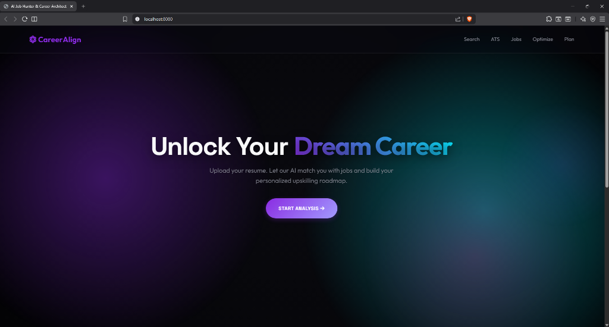
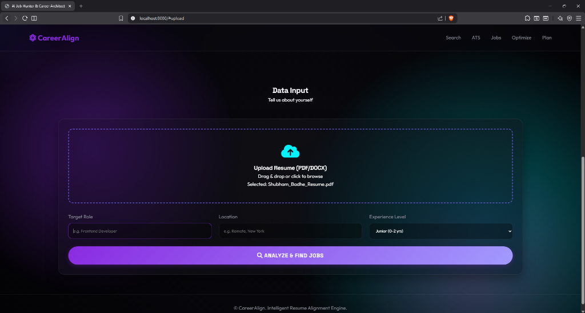
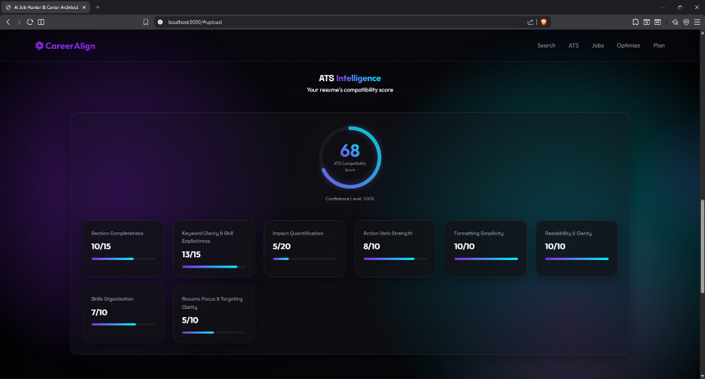
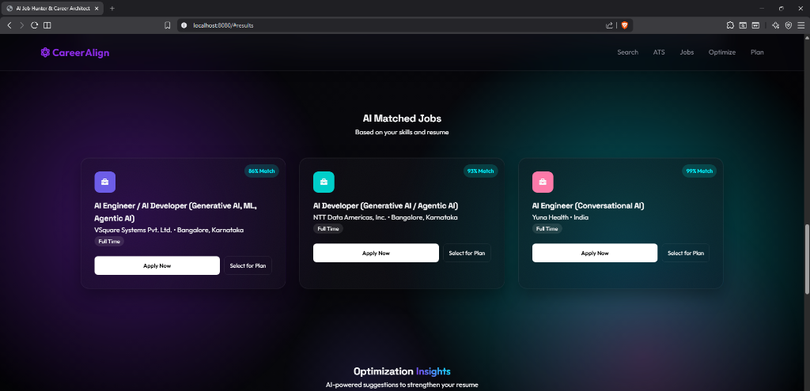
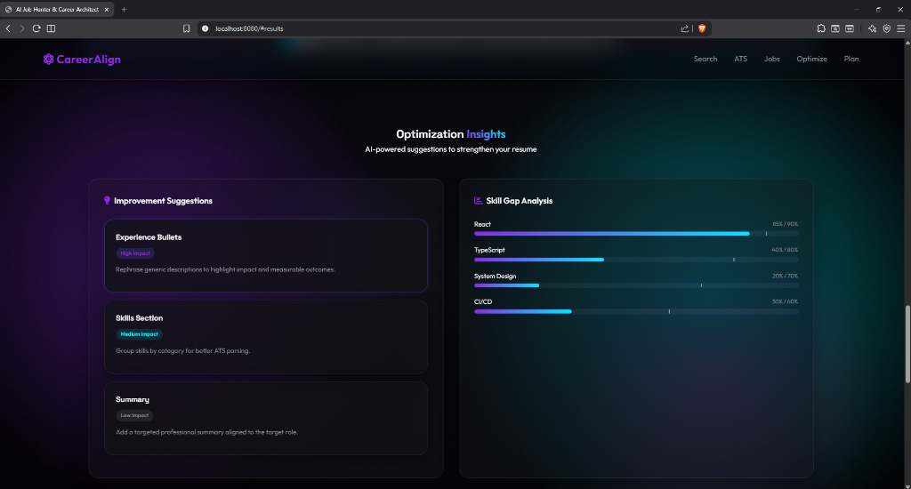
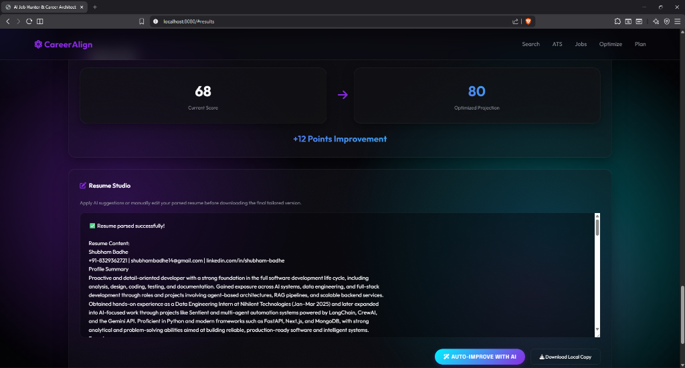
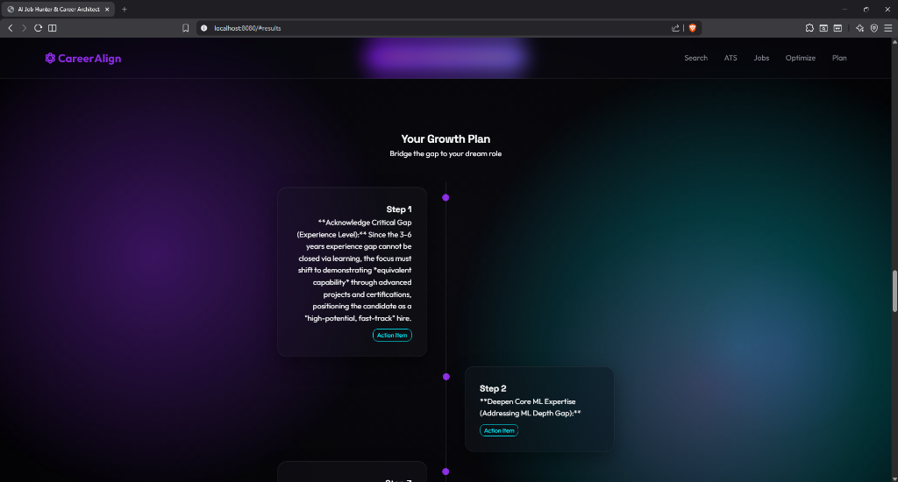

# 🚀 CareerAlign

A robust, multi-agent AI system designed to automate job searching, generate ATS intelligence, highlight skill gaps, and dynamically optimize your resume. Powered by **Google Gemini** and **CrewAI**.


<div align="center">
  
</div>

---

## ✨ Key Features

### 🤖 Intelligent Multi-Agent System
*   **Job Discovery Agent**: Intelligently queries external APIs to find relevant roles based on your parsed resume.
*   **Job Ranking Specialist**: Evaluates and ranks jobs strictly based on description quality and personalized relevance to your profile.
*   **ATS Evaluation Agent**: Deeply acts as an Applicant Tracking System, evaluating section completeness, keyword clarity, impact quantification, and formatting semantics to generate an accurate compatibility score.
*   **Skills Gap Analyst**: Extracts skills from your uploaded resume and contrasts them meticulously against the target job requirements.
*   **Resume Optimization Agent**: Suggests targeted rewrites for your experience bullets, summary, and skills list to specifically match the target role without fabricating history.
*   **Learning Path Curator**: Generates personalized, step-by-step study plans (courses, docs, projects) to bridge any identified missing skills.

### 💻 Seamless Architecture
*   **Vanilla Glass UI**: A beautiful, highly responsive, and interactive frontend unburdened by heavy frameworks, featuring navigation step-guards, narrative AI processing overlays, and optimized cursor interactions.
*   **FastAPI Backend**: A high-performance, async-capable Python server securely managing orchestration between CrewAI agents. 

---

## 📸 Platform Walkthrough

### 1. Unified Data Input
Automatically parse your PDF or DOCX resumes instantly. 
<div align="center"></div>

### 2. Deep ATS Intelligence
Receive an in-depth breakdown of your resume's raw ATS structural compatibility before you even select a job.
<div align="center"></div>

### 3. AI Matched Jobs
Review ranked jobs dynamically tailored to your exact profile. Selecting a job immediately unlocks the next suite of tools.  
<div align="center"></div>

### 4. Optimization Insights & Skill Gaps
Visualize exactly what skills you are missing versus the job description, and read customized, high-impact rewrite suggestions.
<div align="center"></div>

### 5. Resume Studio 
Interactive editing! Apply AI suggestions or manually tweak your parsed resume directly in the browser. See exactly how many points your changes will yield.
<div align="center"></div>

### 6. Growth Plan
Generate an actionable roadmap specifically tailored to bridge the difference between your current skills and your dream job's requirements.
<div align="center"></div>

---

## 🛠️ Installation & Usage

CareerAlign relies on a highly consolidated **"One-Click Launcher"** system designed for Windows.

### Prerequisites
1.  **Clone the repository**:
    ```cmd
    git clone https://github.com/Shubham-Badhe-14/CareerAlign.git
    cd CareerAlign
    ```

2.  **Configure API Keys**:
    Create a `.env` file in the root directory:
    ```ini
    GEMINI_API_KEY=your_gemini_key_here
    ADZUNA_APP_ID=your_adzuna_app_id
    ADZUNA_API_KEY=your_adzuna_api_key
    ```

### 🚀 One-Click Startup (Windows MS-DOS)

We have modernized the app to handle all virtual environment configurations, dependency installations, and dual-server booting autonomously.

Simply open your terminal in the root directory and execute:
```cmd
.\run_app.bat
```

**This single command will:**
1. Check for and safely create an `agent_env` Python virtual environment.
2. Synchronize all PIP dependencies from `requirements.txt`.
3. Launch the FastAPI Backend server in a background window (`http://localhost:8000/docs`).
4. Launch the Vanilla UI local HTTP server in a background window (`http://localhost:8080`).

> **Note:** We have strictly disabled hot-reloading (`--reload`) in production to ensure the Uvicorn backend remains stable when AI agents write active local memories to disk!

---

## 📚 Project Structure

```ascii
CareerAlign/
├── backend/            # FastAPI Backend & CrewAI Agents
├── frontend/           # Vanilla UI (HTML/CSS/JS)
├── docs/               # Screenshots and Docs
├── configs/            # Configuration Files
├── requirements.txt    # Python dependencies
├── run_app.bat         # Master One-Click Executable
└── README.md           # This file
```

## 🔐 Privacy Note
This repository is configured to **ignore** all PDF/DOCX files locally. Your personal resume data stays on your local machine and is not committed to version control.
